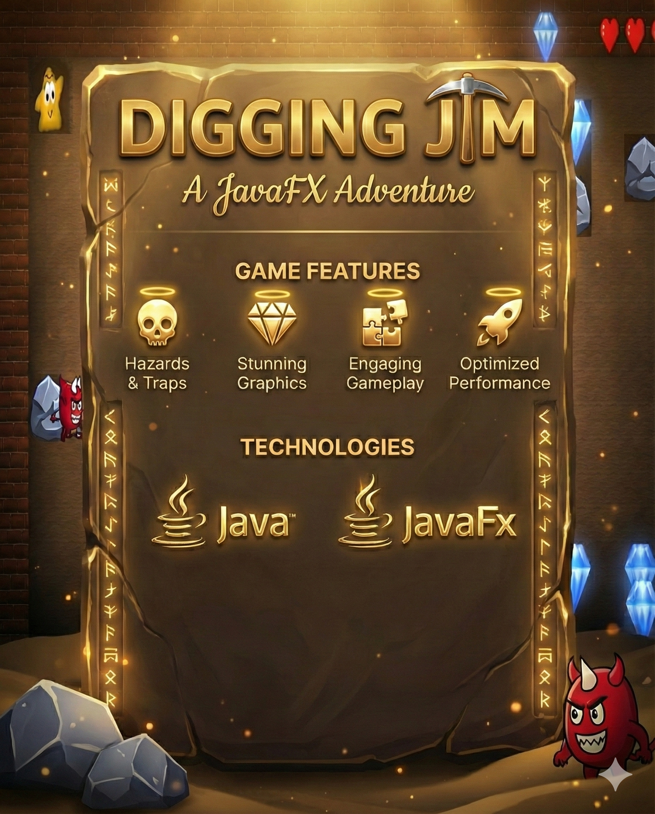

<h1 align="center">⛏️ Digging Jim</h1>

<p align="center">
  
</p>

## 🎮 Download & Play (Windows)

**Ready to play?** You don't need to install Java or Maven to enjoy Digging Jim!

1. Go to the [**Releases**](https://github.com/OmarAfifi-CSE/Digging-Jim/releases) page.
2. Download the `DiggingJim_Portable.zip`.
3. Extract the folder and double-click **`DiggingJim.exe`**.

---

[](https://openjdk.org/)
[](https://openjfx.io/)
[](https://maven.apache.org/)
[](LICENSE)

**Digging Jim** is a high-octane, underground adventure game built with JavaFX. Take control of Jim, a brave explorer on a quest to collect precious diamonds while navigating a world filled with falling rocks, shifting sands, and dangerous monsters.

---

## 🚀 Key Features

- **🎮 Dynamic Gameplay**: Classic digging mechanics inspired by retro legends like *Boulder Dash* and *Dig Dug*.
- **💎 Strategic Collection**: Collect diamonds to unlock the exit door while managing your risk.
- **🪨 Realistic Physics**: Advanced AABB collision resolution with gravity-affected rocks that can stack, be pushed, or crush the unwary.
- **👾 Smart AI**: Monsters with dynamic pathing that challenge your navigation skills.
- **📱 Responsive UI**: A custom viewport scaling system that ensures a perfect 1080p experience on any screen resolution.
- **🎨 Premium Visuals**: High-quality assets, smooth animations, and a polished dark-theme aesthetic.

---

## 🛠️ Technical Highlights

### ⚡ Performance & Physics
The game utilizes a custom physics engine optimized for performance:
- **Spatial Partitioning**: Proximity-based collision checking for sand tiles to ensure 60+ FPS even with hundreds of entities.
- **AABB Resolution**: Robust Axis-Aligned Bounding Box logic for solid interactions and realistic rock pushing.
- **Gravity System**: Dynamic gravity for environment objects with support-checking and landing logic.

### 🧩 Architecture
- **Asset Manager**: Centralized singleton for efficient resource loading and sound management.
- **Level Builder**: Modular level generation allowing for complex and varied underground environments.
- **Animation Timer Loop**: Unified game loop for consistent frame-independent physics updates.

---

## 🕹️ How to Play

### Controls
| Action | Key |
| :--- | :--- |
| **Move Up** | `W` / `Up Arrow` |
| **Move Down** | `S` / `Down Arrow` |
| **Move Left** | `A` / `Left Arrow` |
| **Move Right** | `D` / `Right Arrow` |

### Objectives
1. **Dig** through the sand to find diamonds.
2. **Collect** the required number of diamonds to unlock the exit.
3. **Avoid** monsters and don't let rocks fall on your head!
4. **Reach** the exit door to claim victory.

---

## 📥 Installation & Running

### Prerequisites
- **JDK 21** or higher.
- **Maven 3.9+**.

### Running the Game
1. Clone the repository:
   ```bash
   git clone https://github.com/OmarAfifi-CSE/Digging-Jim.git
   ```
2. Navigate to the project directory:
   ```bash
   cd DiggingJimGame
   ```
3. Run using Maven:
   ```bash
   mvn clean javafx:run
   ```

---
